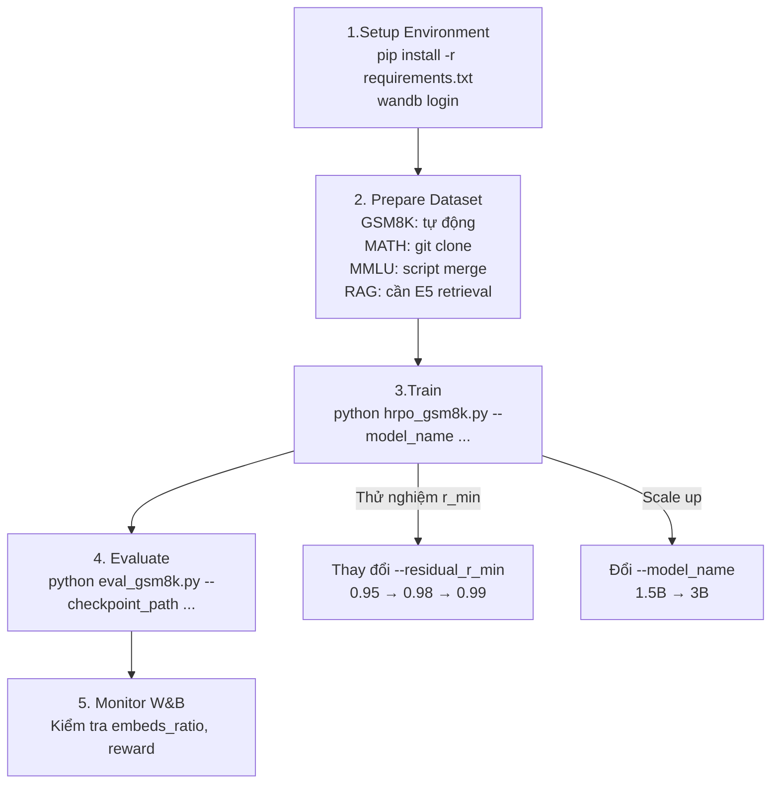

# 🚀 Hướng Dẫn Chạy HRPO Step-by-Step

---

## Phase 1: Chuẩn Bị Môi Trường

### Step 1.1: Yêu cầu phần cứng

| Thành phần | Tối thiểu | Khuyến nghị |
|---|---|---|
| GPU NVIDIA | 1× 24GB VRAM (RTX 3090/4090) | 1× 40GB+ (A100) |
| RAM | 32GB | 64GB |
| Disk | 50GB trống | 100GB+ |
| CUDA | 12.1 | 12.1 |
| Python | 3.11+ | 3.11 |

> [!NOTE]
> Paper nói HRPO **chạy được trên 1 GPU duy nhất** nhờ tối ưu bộ nhớ (UnslothEfficientGRPO). Model 1.5B cần ~20GB, model 3B cần ~35-40GB.

### Step 1.2: Setup environment

```bash
cd /home/namdp36/HRPO

# Tạo venv
python -m venv .venv
source .venv/bin/activate

# Cài đặt dependencies
pip install -r requirements.txt
```

### Step 1.3: Đăng nhập W&B (logging)

```bash
pip install wandb
wandb login
# Nhập API key từ https://wandb.ai/authorize
```

### Step 1.4: Đăng nhập HuggingFace (tải model)

```bash
pip install huggingface_hub
huggingface-cli login
# Nhập token từ https://huggingface.co/settings/tokens
```

---

## Phase 2: Chuẩn Bị Dataset

### Step 2.1: GSM8K (Tự động — không cần chuẩn bị)

GSM8K được tải tự động từ HuggingFace khi chạy script:
```python
# Trong hrpo_gsm8k.py:
dataset = load_dataset('openai/gsm8k', 'main')['train']
```

### Step 2.2: MATH Dataset

```bash
# Tải MATH dataset
cd /home/namdp36
git clone https://github.com/hendrycks/math.git MATH

# Kiểm tra cấu trúc cần có:
# MATH/
# ├── train/
# │   ├── algebra/
# │   ├── counting_and_probability/
# │   ├── geometry/
# │   ├── intermediate_algebra/
# │   ├── number_theory/
# │   ├── prealgebra/
# │   └── precalculus/
# └── test/ (tương tự)
```

Script sẽ load theo cấu trúc này (file `hrpo_math.py` dòng 16–33):
```python
# Đọc tất cả JSON files trong MATH/train/*/
for subject in os.listdir(root_dir):
    for file in os.listdir(subject_dir):
        with open(json_path) as f:
            data = json.load(f)  # Mỗi file có "problem" và "solution"
```

### Step 2.3: MMLU-STEM Dataset

```python
# Tạo file Python tạm: /tmp/prepare_mmlu.py
from datasets import load_dataset, concatenate_datasets

stem_subjects = [
    "abstract_algebra", "anatomy", "astronomy", "college_biology",
    "college_chemistry", "college_computer_science", "college_mathematics",
    "college_physics", "computer_security", "conceptual_physics",
    "electrical_engineering", "elementary_mathematics", "high_school_biology",
    "high_school_chemistry", "high_school_computer_science",
    "high_school_mathematics", "high_school_physics", "high_school_statistics",
    "machine_learning",
]

all_datasets = []
for subject in stem_subjects:
    ds = load_dataset("cais/mmlu", subject, split="auxiliary_train")
    ds = ds.add_column("subject", [subject] * len(ds))
    all_datasets.append(ds)

merged = concatenate_datasets(all_datasets)
merged.save_to_disk("../MMLU_Train_Merged")
print(f"Saved {len(merged)} samples to ../MMLU_Train_Merged")
```

```bash
cd /home/namdp36/HRPO
python /tmp/prepare_mmlu.py
```

### Step 2.4: RAG Dataset (Knowledge QA)

```python
# Tạo file Python tạm: /tmp/prepare_rag.py
from datasets import load_dataset, concatenate_datasets

# Tải từng dataset QA + thêm context từ Wikipedia (cần gọi E5 retrieval)
# Cấu trúc cần có: {"question": str, "contexts": list[str], "golden_answers": list[str]}

# Option 1: Nếu bạn đã có sẵn dữ liệu preprocessed
# Đảm bảo dataset có columns: question, contexts, golden_answers

# Option 2: Tạo từ NQ, TriviaQA datasets
nq = load_dataset("nq_open", split="train")
# ... thêm retrieval context bằng E5 model ...
# merged.save_to_disk("../RAG_Train_Merged")
```

> [!WARNING]
> RAG dataset cần **retrieval context** từ Wikipedia qua E5 embedding model. Paper dùng top-3 passages từ English Wikipedia 2020. Đây là phần phức tạp nhất — nếu chưa có preprocessed data, hãy bắt đầu từ GSM8K hoặc MATH trước.

---

## Phase 3: Training

### Bảng Hyperparameters từ Paper (Table 4)

| Hyperparameter | Giá trị | Ghi chú |
|---|---|---|
| Epochs | 1 | Chỉ 1 epoch |
| Optimizer | AdamW 8-bit | `paged_adamw_8bit` |
| β₁, β₂ | 0.9, 0.99 | |
| Weight Decay | 0.1 | Cao → khuyến khích gating tích hợp latent |
| Learning Rate (LoRA) | 5e-6 | |
| Learning Rate (Gate) | 1e-4 | `thinking_residual_gate_r/i` |
| Learning Rate (Lambda) | 1e-3 | `thinking_residual_Lambda` |
| LR Scheduler | Cosine | |
| Warmup Ratio | 0.1 | |
| Max Grad Norm | 0.1 | Conservative clipping |
| LoRA Rank | 32 | |
| LoRA Alpha | 64 | = rank × 2 |
| Temperature τ | 0.5 | Cho cả generation và Eq. 3 |
| KL Coefficient β | 0.005 | |
| c (Lambda constant) | 8.0 | Cố định |
| r_max | 0.999 | Cố định |

### Bảng cấu hình theo dataset (Table 5)

| Dataset | Group Size G | r_min | Prompt Len | Completion Len | Batch Size |
|---|---|---|---|---|---|
| GSM8K | 4 | 0.99 | 1024 | 1024 | 8 |
| MATH | 8 | 0.99 | 1024 | 1024 | 16 |
| MMLU-ST | 8 | 0.99 | 1024 | 1024 | 16 |
| RAG (Knowledge) | 4 | 0.99 | 2048 | 1024 | 16 |

---

### Step 3.1: Training trên GSM8K (Khuyến nghị bắt đầu từ đây)

```bash
cd /home/namdp36/HRPO

CUDA_VISIBLE_DEVICES=0 python hrpo_gsm8k.py \
  --model_name Qwen/Qwen2.5-1.5B-Instruct \
  --lora_rank 32 \
  --lr 5e-6 \
  --beta 0.005 \
  --residual_r_min 0.99 \
  --residual_r_max 0.999 \
  --lr_residual_gate 1e-4 \
  --lr_residual_Lambda 1e-3 \
  --weight_decay 0.1 \
  --warmup_ratio 0.1 \
  --lr_scheduler_type cosine \
  --optimizer paged_adamw_8bit \
  --max_grad_norm 0.1 \
  --group_size 4 \
  --temperature 0.5 \
  --gradient_accumulation_steps 4 \
  --per_device_train_batch_size 8 \
  --max_prompt_length 1024 \
  --max_completion_length 1024 \
  --seed 42
```

**Thời gian ước tính**: ~2-4 giờ trên A100 (1 GPU), ~6-10 giờ trên RTX 3090.

**Output**: Checkpoint lưu tại `./experiments/Qwen2.5-1.5B-Instruct-gsm8k-group4-lora32-rmin0.99-temp0.5/`

### Step 3.2: Training trên MATH

```bash
CUDA_VISIBLE_DEVICES=0 python hrpo_math.py \
  --model_name Qwen/Qwen2.5-1.5B-Instruct \
  --dataset_root ../MATH \
  --group_size 8 \
  --per_device_train_batch_size 16 \
  --residual_r_min 0.99
```

### Step 3.3: Training trên MMLU-STEM

```bash
CUDA_VISIBLE_DEVICES=0 python hrpo_mmlu.py \
  --model_name Qwen/Qwen2.5-1.5B-Instruct \
  --dataset_root ../MMLU_Train_Merged \
  --group_size 8 \
  --per_device_train_batch_size 16
```

### Step 3.4: Training trên RAG (Knowledge)

```bash
CUDA_VISIBLE_DEVICES=0 python hrpo_rag.py \
  --model_name Qwen/Qwen2.5-1.5B-Instruct \
  --dataset_root ../RAG_Train_Merged \
  --group_size 4 \
  --max_prompt_length 2048
```

### Step 3.5: Training với model 3B (Paper reports)

```bash
# Chỉ cần đổi --model_name, các hyperparameters giữ nguyên
CUDA_VISIBLE_DEVICES=0 python hrpo_gsm8k.py \
  --model_name Qwen/Qwen2.5-3B-Instruct \
  --group_size 4
```

> [!TIP]
> **Nếu hết VRAM**: Giảm `--per_device_train_batch_size` (ví dụ: từ 8 → 4) và tăng `--gradient_accumulation_steps` tương ứng (từ 4 → 8) để giữ effective batch size giống nhau.

---

## Phase 4: Evaluation

### Step 4.1: Đánh giá GSM8K

```bash
CUDA_VISIBLE_DEVICES=0 python eval_gsm8k.py \
  --checkpoint_path ./experiments/Qwen2.5-1.5B-Instruct-gsm8k-group4-lora32-rmin0.99-temp0.5/checkpoint-250 \
  --batch_size 32 \
  --greedy True
```

**Output**: In accuracy ra console + lưu `eval_results.json` trong thư mục checkpoint.

### Step 4.2: Đánh giá MATH và MATH500

```bash
CUDA_VISIBLE_DEVICES=0 python eval_math.py \
  --checkpoint_path ./experiments/<MATH_CHECKPOINT>/checkpoint-250 \
  --batch_size 32 \
  --greedy True
```

### Step 4.3: Đánh giá MMLU-STEM

```bash
CUDA_VISIBLE_DEVICES=0 python eval_mmlust.py \
  --checkpoint_path ./experiments/<MMLU_CHECKPOINT>/checkpoint-250 \
  --batch_size 32 \
  --greedy True
```

### Step 4.4: Đánh giá RAG (5 datasets)

```bash
# Chạy tuần tự trên NQ, TriviaQA, 2WikiMultiHop, HotpotQA, Bamboogle
CUDA_VISIBLE_DEVICES=0 python eval_rag.py \
  --checkpoint_path ./experiments/<RAG_CHECKPOINT>/checkpoint-250 \
  --batch_size 32 \
  --greedy True
```

### Step 4.5: Đánh giá ARC-Challenge

```bash
CUDA_VISIBLE_DEVICES=0 python eval_arcc.py \
  --checkpoint_path ./experiments/<CHECKPOINT>/checkpoint-250 \
  --batch_size 32 \
  --greedy True
```

---

## Phase 5: Theo Dõi & Debug

### Monitoring W&B

Truy cập [wandb.ai](https://wandb.ai) → project `latent-reasoning`. Theo dõi:

| Metric | Ý nghĩa | Kỳ vọng (healthy training) |
|---|---|---|
| `reward` | Mean reward | Tăng dần |
| `reward_std` | Std within groups | Giảm dần |
| `embeds_ratio` | Tỷ lệ token embedding (`a_t²`) | Giảm dần (từ ~1.0) |
| `hidden_ratio` | Tỷ lệ hidden state (`√(1-a_t²)`) | Tăng dần (từ ~0.0) |
| `kl` | KL divergence | Tăng nhẹ rồi ổn định |
| `completion_length` | Độ dài completion | Tăng ban đầu → giảm |

> [!IMPORTANT]
> **Tín hiệu training tốt** (theo paper Section 4.3):
> - `hidden_ratio` tăng đều → model đang học sử dụng latent reasoning
> - `completion_length` giảm → model suy luận hiệu quả hơn (ít token hơn)
> - `reward` > 0 ngay từ đầu → gating khởi tạo đúng

### Troubleshooting

| Vấn đề | Nguyên nhân | Giải pháp |
|---|---|---|
| `reward = 0` liên tục | Format sai hoặc r_min quá thấp | Tăng `--residual_r_min` lên 0.99 |
| OOM (Out of Memory) | Batch quá lớn | Giảm `--per_device_train_batch_size`, tăng `--gradient_accumulation_steps` |
| NaN loss | Gradient explosion | Giảm `--max_grad_norm` (thử 0.05), giảm LR |
| Experiment exists error | Thư mục đã tồn tại | Xóa thư mục hoặc đổi tham số |
| Reward collapse (đang tốt rồi giảm) | Interpolation noise (nếu hack) | Đúng paper thì HRPO tránh issue này, kiểm tra r_min |

---

## Tóm Tắt Thứ Tự Chạy



> [!TIP]
> **Khuyến nghị thứ tự thử nghiệm:**
> 1. **GSM8K + 1.5B** (nhanh nhất, ~2-4h) → Verify pipeline hoạt động
> 2. **MATH + 1.5B** → Benchmark reasoning  
> 3. **GSM8K + 3B** → Scale model size
> 4. **Thử nghiệm r_min** (0.95, 0.98, 0.99) → Tìm optimal, paper gợi ý knowledge tasks nên dùng r_min thấp (0.95–0.98), STEM tasks nên dùng r_min cao (0.99) hoặc rất thấp
