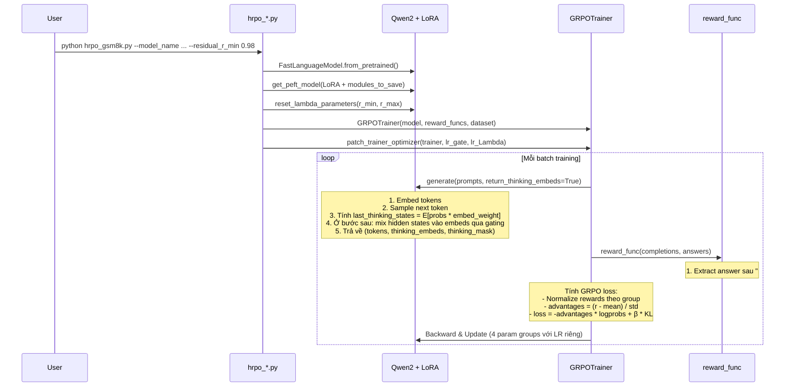
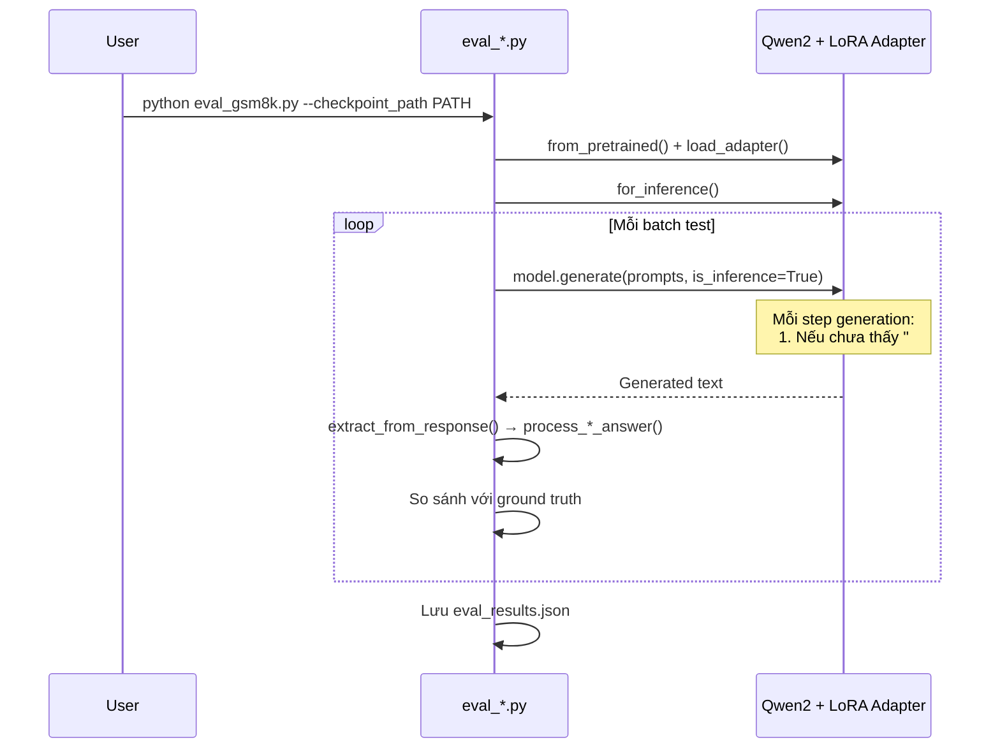

# 📋 Báo Cáo Phân Tích Source Code HRPO
## Hybrid Latent Reasoning via Reinforcement Learning

> **Paper**: [Hybrid Latent Reasoning via Reinforcement Learning](https://arxiv.org/abs/2505.18454)  
> **Tác giả**: Zhenrui Yue, Bowen Jin, Huimin Zeng, Honglei Zhuang, Zhen Qin, Jinsung Yoon, Lanyu Shang, Jiawei Han, Dong Wang

---

## 1. Tổng Quan Dự Án

HRPO (**Hybrid Reasoning Policy Optimization**) là một phương pháp huấn luyện LLM sử dụng **Reinforcement Learning** để kích hoạt khả năng **suy luận tiềm ẩn (latent reasoning)** — cho phép mô hình "suy nghĩ" bằng cả **token rời rạc** (discrete) lẫn **hidden states liên tục** (continuous) thay vì chỉ dựa vào Chain-of-Thought text.

### Ý tưởng cốt lõi
Thay vì chỉ suy luận qua text (CoT), HRPO:
1. **Tích hợp hidden states** của bước trước vào embedding của token hiện tại thông qua **cơ chế gating học được**
2. **Khởi tạo** chủ yếu từ token embeddings, rồi **dần dần** tích hợp thêm hidden features trong quá trình training
3. Sử dụng **GRPO** (Group Relative Policy Optimization) để tối ưu chính sách thông qua RL

---

## 2. Cấu Trúc Thư Mục

```
HRPO/
├── hrpo_gsm8k.py          # Script training trên GSM8K
├── hrpo_math.py           # Script training trên MATH
├── hrpo_mmlu.py           # Script training trên MMLU
├── hrpo_rag.py            # Script training trên RAG
├── eval_gsm8k.py          # Script đánh giá trên GSM8K
├── eval_math.py           # Script đánh giá trên MATH
├── eval_mmlust.py         # Script đánh giá trên MMLU-STEM
├── eval_rag.py            # Script đánh giá trên RAG (NQ, TQ, 2Wiki, HotpotQA, Bamboogle)
├── eval_arcc.py           # Script đánh giá trên ARC-C, OpenBookQA, QASC
├── utils.py               # Hàm tiện ích: reward functions, xử lý câu trả lời
├── patch.py               # Patch optimizer cho các tham số HRPO
├── main.py                # Entry point placeholder
├── requirements.txt       # Dependencies (PyTorch 2.5.1, CUDA 12.1)
├── pyproject.toml          # Python ≥3.11
├── transformers/           # ⚡ Thư viện transformers ĐÃ ĐƯỢC SỬA ĐỔI
│   ├── models/
│   │   ├── qwen2/modeling_qwen2.py    # Thêm thinking_residual vào Qwen2Model
│   │   └── llama/modeling_llama.py    # Thêm thinking_residual vào LlamaModel
│   └── generation/utils.py            # Sửa _sample() để hỗ trợ latent reasoning
├── trl/                    # ⚡ Thư viện TRL ĐÃ ĐƯỢC SỬA ĐỔI
│   └── trainer/grpo_trainer.py        # Sửa GRPO Trainer truyền thinking_embeds
├── unsloth/                # ⚡ Thư viện Unsloth ĐÃ ĐƯỢC SỬA ĐỔI
│   ├── models/
│   │   ├── llama.py                   # Fast forward + thinking_residual integration
│   │   └── qwen2.py                   # Wrapper gọi FastLlamaModel cho Qwen2
│   └── trainer.py                     # Unsloth training utilities
└── assets/intro.png
```

---

## 3. Giải Thích Chi Tiết Từng Phần

### 3.1. Cơ Chế Core: [thinking_residual](file:///home/namdp36/HRPO/transformers/models/qwen2/modeling_qwen2.py#530-535) (Gating Mechanism)

> **📍 File**: [modeling_qwen2.py](file:///home/namdp36/HRPO/transformers/models/qwen2/modeling_qwen2.py#L469-L534)

Đây là **trái tim** của HRPO. Ba thành phần chính được thêm vào [Qwen2Model](file:///home/namdp36/HRPO/transformers/models/qwen2/modeling_qwen2.py#492-794):

#### a. [ThinkingResidualLambda](file:///home/namdp36/HRPO/transformers/models/qwen2/modeling_qwen2.py#469-490) (dòng 469–489)

```python
class ThinkingResidualLambda(nn.Module):
    c = 8.0
    def __init__(self, config):
        self.Lambda = nn.Parameter(torch.randn(config.hidden_size))

    def reset_lambda_parameters(self, r_min=0.9, r_max=0.999):
        # Khởi tạo Lambda sao cho a_t ≈ 1 (gần như chỉ dùng token embeds ban đầu)
        nn.init.uniform_(self.Lambda, a=r_min, b=r_max)
        self.Lambda.data.copy_(- torch.log((self.Lambda ** (-1./self.c)) - 1))

    def forward(self, r_t):
        a_t = torch.exp(-self.c * F.softplus(-self.Lambda) * r_t)
        return a_t
```

- `r_min` càng gần 1 → `a_t` ban đầu càng gần 1 → model ban đầu chỉ dùng token embeddings
- Theo thời gian training, [Lambda](file:///home/namdp36/HRPO/transformers/models/qwen2/modeling_qwen2.py#469-490) học để giảm `a_t` → tích hợp nhiều hidden states hơn

#### b. Gating trong `Qwen2Model.__init__` (dòng 517–519)

```python
self.thinking_residual_gate_r = nn.Linear(hidden_size, hidden_size)  # Gate "retain"
self.thinking_residual_gate_i = nn.Linear(hidden_size, hidden_size)  # Gate "input"
self.thinking_residual_Lambda = ThinkingResidualLambda(config)        # Lambda parameter
```

#### c. Hàm [thinking_residual()](file:///home/namdp36/HRPO/transformers/models/qwen2/modeling_qwen2.py#530-535) (dòng 530–534)

```python
def thinking_residual(self, embeds, residual, eps=1e-8):
    r_t = sigmoid(self.thinking_residual_gate_r(embeds))   # Retain gate
    i_t = sigmoid(self.thinking_residual_gate_i(embeds))   # Input gate
    a_t = self.thinking_residual_Lambda(r_t)               # Decay factor
    return a_t * embeds + sqrt(1 - a_t² + eps) * (i_t * residual), a_t
```

**Công thức**: `X̂_t = a_t · e_t + √(1 - a_t²) · (i_t · h_{t-1})`
- [e_t](file:///home/namdp36/HRPO/transformers/generation/utils.py#5043-5066): token embedding hiện tại
- `h_{t-1}`: hidden state từ bước trước (residual)
- `a_t`: hệ số cân bằng (gần 1 = ưu tiên token embedding, gần 0 = ưu tiên hidden states)
- `i_t`: gate kiểm soát lượng hidden state được đưa vào

> [!IMPORTANT]
> Thiết kế đảm bảo `‖X̂_t‖ ≈ ‖e_t‖` nhờ ràng buộc `a_t² + (1-a_t²) = 1`, giữ ổn định gradient.

---

### 3.2. Sửa Đổi Generation: [_sample()](file:///home/namdp36/HRPO/transformers/generation/utils.py#3198-3428) trong transformers

> **📍 File**: [generation/utils.py](file:///home/namdp36/HRPO/transformers/generation/utils.py#L3198-L3427)

Hàm [_sample()](file:///home/namdp36/HRPO/transformers/generation/utils.py#3198-3428) được sửa đổi để hỗ trợ **latent reasoning trong inference**:

1. **Tính `last_thinking_states`** (dòng 3369–3372):
   ```python
   # Weighted average của tất cả token embeddings theo xác suất
   last_thinking_states = einsum('bv,vd->bd', probs, embed_weight)
   last_thinking_states /= sqrt(sum(probs², dim=-1))
   ```
   → Đây là **"suy nghĩ"** liên tục: thay vì commit vào 1 token, model tạo hidden state là trung bình có trọng số.

2. **Xác định vùng "thinking"** (dòng 3368):
   ```python
   is_thinking = [self.answer_start not in s for s in strs]
   ```
   → Model chỉ dùng latent reasoning trong phần **suy luận**, không dùng trong phần **trả lời** (sau `####`).

3. **Truyền ngược thinking states** vào model forward (dòng 3304–3305):
   → Ở bước tiếp theo, `is_thinking` và `last_thinking_states` được truyền vào [CausalLM_fast_forward](file:///home/namdp36/HRPO/unsloth/models/llama.py#1031-1207) để thực hiện gating.

---

### 3.3. Sửa Đổi Model Forward trong Unsloth

> **📍 File**: [llama.py](file:///home/namdp36/HRPO/unsloth/models/llama.py#L580-L670) (Training)  
> **📍 File**: [llama.py](file:///home/namdp36/HRPO/unsloth/models/llama.py#L924-L1028) (Inference)

#### Training path ([LlamaModel_fast_forward](file:///home/namdp36/HRPO/unsloth/models/llama.py#581-920), dòng 660–669):
```python
if thinking_mask is not None:
    new_inputs_embeds[thinking_mask] = self.thinking_residual(
        inputs_embeds[thinking_mask], thinking_embeds[thinking_mask],
    )[0].to(inputs_embeds.dtype)
```
→ Trong training, `thinking_embeds` (thu được từ generation) được sử dụng lại để tính loss.

#### Inference path ([LlamaModel_fast_forward_inference](file:///home/namdp36/HRPO/unsloth/models/llama.py#924-1028), dòng 940–949):
```python
if is_thinking and last_thinking_states:
    X_hat, a_t = self.model.thinking_residual(X, last_thinking_states.unsqueeze(1))
    X[is_thinking] = X_hat[is_thinking].to(X.dtype)
```
→ Trong inference, hidden state từ bước trước được mix vào embedding hiện tại.

---

### 3.4. GRPO Trainer Sửa Đổi

> **📍 File**: [grpo_trainer.py](file:///home/namdp36/HRPO/trl/trainer/grpo_trainer.py#L562-L696)

Thay đổi quan trọng trong [_prepare_inputs()](file:///home/namdp36/HRPO/trl/trainer/grpo_trainer.py#520-697):

```python
# Generation trả về thêm thinking_embeds, thinking_mask, embeds_ratio
prompt_completion_ids, thinking_embeds, thinking_mask, embeds_ratio = unwrapped_model.generate(
    prompt_ids, ..., return_thinking_embeds=True,
)
```

Dữ liệu `thinking_embeds` và `thinking_mask` được đưa vào dict trả về để dùng khi tính loss.

---

### 3.5. Optimizer Patch

> **📍 File**: [patch.py](file:///home/namdp36/HRPO/patch.py)

Tách tham số thành **4 nhóm** với learning rate riêng:

| Nhóm | Learning Rate Mặc Định | Ý Nghĩa |
|---|---|---|
| LoRA params (có weight decay) | `5e-6` | Tham số LoRA adapter chính |
| LoRA params (không weight decay) | `5e-6` | Bias, LayerNorm |
| `thinking_residual_gate` (r, i) | `1e-4` | Gates cần học nhanh hơn |
| `thinking_residual_Lambda` | `1e-3` | Lambda cần học nhanh nhất |

> [!NOTE]
> Lambda cần LR cao nhất (1e-3) vì nó kiểm soát tốc độ chuyển đổi từ "chỉ token" sang "hybrid reasoning".

---

### 3.6. Utils: Reward Functions & Answer Processing

> **📍 File**: [utils.py](file:///home/namdp36/HRPO/utils.py)

#### System Prompt
```
"...The assistant first thinks about the reasoning process in the mind
and then provides the user with the answer. The final answer is provided
after #### tag, i.e., {reasoning} #### {answer}."
```
→ Model được hướng dẫn suy nghĩ trước `####` rồi trả lời sau `####`.

#### Reward Function ([get_reward_func](file:///home/namdp36/HRPO/utils.py#39-63))
Phần thưởng = **1.0** nếu thỏa MÂN **cả 2** điều kiện:
1. Câu trả lời **đúng** (exact match sau preprocessing)
2. Format **hợp lệ** (chỉ có đúng 1 tag `####` trong response)

→ Nếu sai đáp án HOẶC format sai → reward = **0.0**

#### Answer Processors

| Hàm | Dataset | Xử lý |
|---|---|---|
| [process_gsm8k_answer](file:///home/namdp36/HRPO/utils.py#268-278) | GSM8K | Trích số cuối cùng, loại bỏ dấu phẩy |
| [process_math_answer](file:///home/namdp36/HRPO/utils.py#280-296) | MATH | Trích từ `\boxed{}` hoặc LaTeX, chuẩn hóa ký hiệu |
| [process_mmlu_answer](file:///home/namdp36/HRPO/utils.py#298-311) | MMLU | Trích chữ cái cuối cùng (A-J) |
| [process_qa_answer](file:///home/namdp36/HRPO/utils.py#313-328) | RAG | Lowercase, loại bỏ articles/punctuation |

---

### 3.7. Training Scripts

> **📍 Files**: [hrpo_gsm8k.py](file:///home/namdp36/HRPO/hrpo_gsm8k.py), [hrpo_math.py](file:///home/namdp36/HRPO/hrpo_math.py), [hrpo_mmlu.py](file:///home/namdp36/HRPO/hrpo_mmlu.py), [hrpo_rag.py](file:///home/namdp36/HRPO/hrpo_rag.py)

Tất cả 4 script có cùng cấu trúc:

```mermaid
flowchart TD
    A[1. Import & Patch Unsloth] --> B[2. Load Model + Tokenizer]
    B --> C[3. Apply LoRA + modules_to_save]
    C --> D["4. Reset Lambda (r_min, r_max)"]
    D --> E[5. Configure GRPOConfig]
    E --> F[6. Load & Preprocess Dataset]
    F --> G[7. Create GRPOTrainer]
    G --> H[8. Patch Optimizer LRs]
    H --> I[9. trainer.train()]
```

#### Khác biệt giữa các script:

| Script | Dataset Source | Default group_size | max_prompt_length |
|---|---|---|---|
| [hrpo_gsm8k.py](file:///home/namdp36/HRPO/hrpo_gsm8k.py) | HuggingFace `openai/gsm8k` | 4 | 1024 |
| [hrpo_math.py](file:///home/namdp36/HRPO/hrpo_math.py) | Local JSON files từ `../MATH` | 8 | 1024 |
| [hrpo_mmlu.py](file:///home/namdp36/HRPO/hrpo_mmlu.py) | Local disk `../MMLU_Train_Merged` | 8 | 1024 |
| [hrpo_rag.py](file:///home/namdp36/HRPO/hrpo_rag.py) | Local disk `../RAG_Train_Merged` | 4 | 2048 |

---

### 3.8. Evaluation Scripts

> **📍 Files**: [eval_gsm8k.py](file:///home/namdp36/HRPO/eval_gsm8k.py), [eval_math.py](file:///home/namdp36/HRPO/eval_math.py), [eval_mmlust.py](file:///home/namdp36/HRPO/eval_mmlust.py), [eval_rag.py](file:///home/namdp36/HRPO/eval_rag.py), [eval_arcc.py](file:///home/namdp36/HRPO/eval_arcc.py)

Luồng chung:
1. Load base model → Load LoRA adapter → Set inference mode
2. Load test dataset
3. Batch generate → Decode → Extract answer → So sánh
4. Tính accuracy → Lưu `eval_results.json` vào checkpoint dir

---

## 4. Flow Chạy Toàn Bộ Source Code

### 4.1. Training Flow



### 4.2. Inference Flow



---

## 5. Ảnh Hưởng Khi Thay Đổi Tham Số

| Tham số | Giá trị mặc định | ↑ Tăng | ↓ Giảm |
|---|---|---|---|
| `--residual_r_min` | 0.99 | `a_t` → 1: model dùng ít hidden states hơn, ổn định nhưng latent reasoning yếu | `a_t` → 0: mix nhiều hidden states, latent reasoning mạnh nhưng có thể unstable |
| `--group_size` | 4–8 | Ước lượng advantage chính xác hơn, nhưng tốn VRAM | Variance cao hơn trong reward estimation |
| `--temperature` | 0.5 | Exploration nhiều hơn, diversity cao | Exploitation, ít diversity |
| `--beta` | 0.005 | KL penalty mạnh → gần reference model hơn | Cho phép policy thay đổi nhiều hơn |
| `--lr_residual_gate` | 1e-4 | Gates học nhanh → hybrid nhanh | Gates học chậm → chuyển đổi dần |
| `--lr_residual_Lambda` | 1e-3 | Lambda thay đổi nhanh → thoát "pure token" sớm | Lambda thay đổi chậm → giữ ổn định lâu hơn |
| `--lora_rank` | 32 | Capacity cao hơn, tốn VRAM | Capacity thấp, ít VRAM |
| `--max_completion_length` | 1024 | Cho phép reasoning dài hơn | Tiết kiệm bộ nhớ |

---

## 6. Hướng Dẫn Chạy Source Code

### 6.1. Yêu Cầu Hệ Thống

- **Python** ≥ 3.11
- **PyTorch** ≥ 2.5.1 với **CUDA 12.1**
- **GPU**: Tối thiểu 1 GPU NVIDIA (khuyến nghị ≥ 24GB VRAM cho model 3B)
- **RAM**: ≥ 32GB

### 6.2. Cài Đặt

```bash
# 1. Clone repo & vào thư mục
cd /home/namdp36/HRPO

# 2. Tạo virtual environment (nếu chưa có)
python -m venv .venv
source .venv/bin/activate

# 3. Cài đặt dependencies
pip install -r requirements.txt

# 4. Cài đặt local packages (transformers, trl, unsloth đã sửa đổi)
#    Các thư viện này được import trực tiếp từ thư mục local,
#    KHÔNG CẦN pip install riêng vì Python path đã chỉ thẳng vào đây.
```

> [!WARNING]
> Các thư viện `transformers/`, [trl/](file:///home/namdp36/HRPO/unsloth/trainer.py#209-226), [unsloth/](file:///home/namdp36/HRPO/unsloth/trainer.py#48-61) trong repo này là **phiên bản đã được sửa đổi**. KHÔNG nên cài đặt lại chúng từ PyPI vì sẽ ghi đè các thay đổi HRPO.

### 6.3. Training

```bash
# Training trên GSM8K (nhẹ nhất, dùng HuggingFace dataset)
CUDA_VISIBLE_DEVICES=0 python hrpo_gsm8k.py \
  --model_name Qwen/Qwen2.5-3B-Instruct \
  --residual_r_min 0.98 \
  --group_size 8

# Training trên MATH (cần tải dataset MATH về ../MATH)
CUDA_VISIBLE_DEVICES=0 python hrpo_math.py \
  --model_name Qwen/Qwen2.5-3B-Instruct \
  --dataset_root ../MATH \
  --residual_r_min 0.98

# Training trên MMLU (cần merge dataset trước, lưu vào ../MMLU_Train_Merged)
CUDA_VISIBLE_DEVICES=0 python hrpo_mmlu.py \
  --model_name Qwen/Qwen2.5-3B-Instruct \
  --dataset_root ../MMLU_Train_Merged

# Training trên RAG (cần merge dataset trước, lưu vào ../RAG_Train_Merged)
CUDA_VISIBLE_DEVICES=0 python hrpo_rag.py \
  --model_name Qwen/Qwen2.5-3B-Instruct \
  --dataset_root ../RAG_Train_Merged
```

Kết quả training lưu vào `./experiments/<tên>-<dataset>-group<G>-lora<R>-rmin<rmin>-temp<T>/`.

### 6.4. Evaluation

```bash
# Đánh giá trên GSM8K
CUDA_VISIBLE_DEVICES=0 python eval_gsm8k.py \
  --checkpoint_path ./experiments/Qwen2.5-3B-Instruct-gsm8k-group8-lora32-rmin0.98-temp0.5/checkpoint-250 \
  --batch_size 32 \
  --greedy True

# Đánh giá trên MATH
CUDA_VISIBLE_DEVICES=0 python eval_math.py \
  --checkpoint_path PATH/TO/CHECKPOINT \
  --batch_size 32

# Đánh giá trên MMLU-STEM
CUDA_VISIBLE_DEVICES=0 python eval_mmlust.py \
  --checkpoint_path PATH/TO/CHECKPOINT

# Đánh giá trên RAG (chạy tuần tự trên NQ, TQ, 2Wiki, HotpotQA, Bamboogle)
CUDA_VISIBLE_DEVICES=0 python eval_rag.py \
  --checkpoint_path PATH/TO/CHECKPOINT

# Đánh giá trên ARC-Challenge
CUDA_VISIBLE_DEVICES=0 python eval_arcc.py \
  --checkpoint_path PATH/TO/CHECKPOINT
```

### 6.5. Lưu Ý Quan Trọng

> [!CAUTION]
> 1. **Datasets**: MMLU và RAG cần **merge datasets trước** rồi lưu bằng `Dataset.save_to_disk()`. GSM8K tự tải từ HuggingFace. MATH cần tải về cấu trúc thư mục chuẩn.
> 2. **WandB**: Training log vào W&B project `latent-reasoning`. Cần đăng nhập `wandb login` trước khi chạy.
> 3. **Prevent duplicate experiments**: Script sẽ **thoát** nếu thư mục experiment đã tồn tại và không rỗng.
> 4. **VRAM**: Model 3B + LoRA rank 32 + group_size 8 cần khoảng **~40GB VRAM** (batch_size 16). Điều chỉnh `per_device_train_batch_size` và `group_size` nếu cần.

---

## 7. Tóm Tắt Kiến Trúc

```mermaid
graph TB
    subgraph "HRPO Core Innovation"
        A["Token Embedding e_t"] --> G["Gating Mechanism"]
        B["Hidden State h_{t-1}"] --> G
        G --> C["Hybrid Embedding X̂_t"]
        C --> D["Transformer Layers"]
        D --> E["Next Token Prediction"]
        E -->|"probs"| F["last_thinking_states = Σ(p_i × e_i)"]
        F -->|"next step"| B
    end

    subgraph "Gating Components"
        G1["r_t = σ(W_r · e_t)"] --> G2["a_t = Λ(r_t)"]
        G3["i_t = σ(W_i · e_t)"] --> G4["X̂ = a_t·e_t + √(1-a_t²)·(i_t·h_{t-1})"]
    end

    subgraph "RL Training (GRPO)"
        T1["Sample G completions per prompt"] --> T2["Compute rewards"]
        T2 --> T3["Normalize rewards per group"]
        T3 --> T4["Policy gradient + KL penalty"]
    end
```


